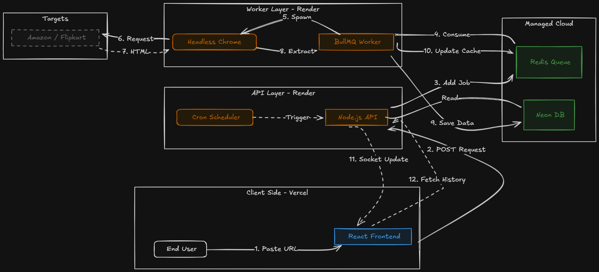
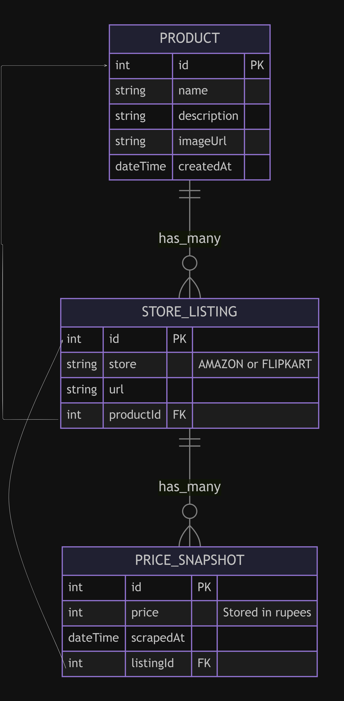

<div align="center">
  <h1>PriceMatrix</h1>
  
  <p>
    <strong>Distributed Real-Time E-Commerce Price Tracker</strong>
  </p>

  <p>
    <a href="#system-architecture">Architecture</a> •
    <a href="#key-features">Features</a> •
    <a href="#installation">Installation</a> •
    <a href="#technical-decisions">Tech Decisions</a>
  </p>

  
  
  
  
  
</div>

## Demo
> **Live Production URL:** [https://price-matrix-frontend.vercel.app/](https://price-matrix-frontend.vercel.app/)

## About The Project

**PriceMatrix** is a cloud-native, distributed system designed to bridge the gap between simple scraping scripts and enterprise-grade e-commerce tracking tools.

Most price trackers are fragile—they run on the main thread, get blocked by anti-bot protections, or crash when multiple users try to track products simultaneously. **PriceMatrix** solves this by offloading the heavy lifting to a dedicated backend architecture. It decouples the user-facing API from the resource-intensive scraping engine, allowing the system to:

* **Track at Scale:** Offload heavy browser automation tasks to a **Redis-backed queue**, ensuring the API remains responsive even under high concurrency.
* **Bypass Protections:** Utilize a **stealth-enhanced Singleton browser** instance that rotates user agents and manages sessions to evade bot detection on Amazon and Flipkart.
* **Watch in Real-Time:** Receive instant feedback via **WebSockets** the moment a price is extracted, eliminating the need for manual page refreshes or polling.
* **Analyze Trends:** Persist historical data in **PostgreSQL** to visualize price fluctuations over time and help users identify the perfect buying window.

## <span id="system-architecture"> System Architecture</span>

The system follows an **Event-Driven Architecture** where the "Brain" (API) is distinct from the "Muscle" (Workers).



### The Workflow:
1.  **Client Request:** User inputs a product URL via the React Frontend.
2.  **Producer (API):** The Node.js server validates the URL and pushes a job to the **Redis Queue** (BullMQ).
3.  **Queue Buffer:** Acts as a shock absorber, holding jobs until a worker is free.
4.  **Consumer (Worker):** An isolated Docker container pulls the job and spawns a headless browser.
5.  **Feedback:** Upon completion, the worker updates the Database and triggers a **WebSocket event** to refresh the Client UI instantly.

---

## <span id="data-pipeline"> ETL Data Pipeline</span>

The core scraping logic follows a strict **Extract-Transform-Load (ETL)** process to ensure data integrity.

<p align="center">
  
</p>

1.  **Extract:** Headless Chrome navigates to the target URL and extracts the raw DOM elements.
2.  **Transform:**
    * **Sanitization:** Regex removes currency symbols (`₹`, `$`, `,`) and non-numeric characters.
    * **Normalization:** Prices are parsed and cast to **Integers** (e.g., `1499.00` -> `1499`) to ensure mathematical consistency.
3.  **Load:**
    * **Hot Path:** Data pushed to Frontend via Socket.io.
    * **Cold Path:** Data persisted to **PostgreSQL** via Prisma.

---

##  Database Schema

The database is normalized to support **One-to-Many** relationships, allowing a single generic product (e.g., "iPhone 13") to have multiple store listings (Amazon, Flipkart).

<p align="center">
  
</p>

---

###  Key Features
* **Stealth Scraping Engine:** Bypasses anti-bot protections using Puppeteer with stealth plugins and randomized User-Agents.
* **Real-Time Feedback Loop:** Uses **Socket.io** to push instant price updates to the frontend the millisecond a job completes.
* **Historical Analytics:** Persists price snapshots to visualize trends over time (e.g., "Lowest Price in 30 Days").
* **Distributed & Resilient:** Powered by **Redis Queues (BullMQ)** to ensure zero job loss even if the worker crashes.

---

## <span id="tech-stack"> Tech Stack</span>

### **Backend & Systems**
*  **Node.js & Express**
*  **Redis (Upstash)**
*  **PostgreSQL (Neon)**
*  **Docker**
* **Puppeteer** (Headless Chrome Automation)

### **Frontend**
*  **React.js**

*  **Socket.io**

---
##  Local Installation

**Prerequisites:** Docker & Docker Compose.

1.  **Clone the Repo**
    ```bash
    git clone [https://github.com/Blitzkrieg28/PriceMatrix.git](https://github.com/Blitzkrieg28/PriceMatrix.git)
    cd PriceMatrix
    ```

2.  **Setup Environment**
    Create a `.env` file:
    ```env
    DATABASE_URL="postgresql://..."
    REDIS_URL="redis://..."
    PORT=3000
    ```

3.  **Run with Docker**
    ```bash
    docker-compose up --build
    ```
    * **Backend:** `http://localhost:3000`
    * **Frontend:** `http://localhost:3001`

---
##  Technical Decisions & Trade-offs

### 1. WebSockets vs. Polling
* **Decision:** Used **WebSockets (Socket.io)** instead of Short Polling.
* **Why?** Unlike file downloads (which take minutes), price scraping is often fast (2-5 seconds). WebSockets provide a "delightful" UX where the price pops up instantly, reducing server load from constant HTTP polling requests.

### 2. Singleton Browser Pattern
* **Decision:** Implemented a **Singleton Headless Browser** instance via Puppeteer.
* **Why:** Launching a full Chrome process takes time and CPU. Instead of spawning a new browser for every request, we maintain **one** persistent browser instance and simply open/close lightweight *tabs* (pages) for each job. This reduced RAM usage by **~40%** and eliminated the 2-second browser startup latency.

### 3. Producer-Consumer Pattern
* **Decision:** Decoupled scraping logic using **BullMQ**.
* **Why:** Browsers are RAM-heavy (~100MB per tab). If we ran Puppeteer directly in the API route, 10 concurrent users could crash the server (OOM). The Queue limits concurrency (e.g., max 2 browsers at once), protecting the infrastructure.

### 4. Integer Math for Money
* **Decision:** Stored prices as **Integers** in Postgres.
* **Why:** Storing currency as Floats is dangerous due to IEEE 754 precision errors (e.g., `0.1 + 0.2 = 0.300000004`). We store raw values and format them only on the frontend.


##  Contributing

Contributions are welcome!
1.  Fork the Project
2.  Create your Feature Branch (`git checkout -b feature/AmazingFeature`)
3.  Commit your Changes (`git commit -m 'Add some AmazingFeature'`)
4.  Push to the Branch (`git push origin feature/AmazingFeature`)
5.  Open a Pull Request

---

##  License

Distributed under the MIT License. See `LICENSE` for more information.
<div align="center">
  <sub>Built with ❤️ by <a href="https://github.com/Blitzkrieg28">Blitzkrieg28</a></sub>
</div>